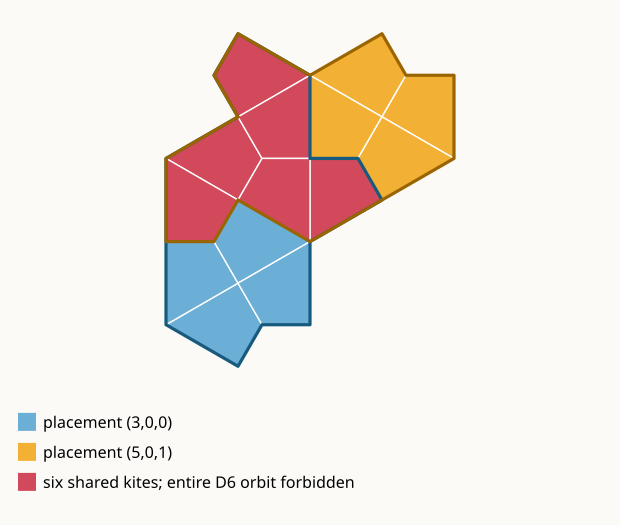

# Session 34 — a packing-sensitive invariant from one collision orbit

**Date:** 2026-07-18  
**Scope:** refine the saturated V4 local SFT with the smallest natural piece
of nonoverlap and test the three index-60 escapes.

## Starting point

The full product of all 16 distinct-tail A4/V4 signatures has a common
countermodel on HNF `(2,0,2)` and on the three index-60 escapes. The lifted
witness selects 45 area-10 placements for 360 cells, versus 36 placements in
an exact cover. Global budget optimization proved substantially harder than
ordinary satisfiability, so the experiment turned to the local geometry of
the excess.

Modulo V4 gauge, the base full product has 20 compatible-placement patterns:
12 patterns permit three placements and eight permit six. In the recorded
phase exactly three of 48 placements are compatible. They cover 18 base cells
once and six twice.

## Collision-orbit classification

On each index-60 lifted witness there are exactly 15 colliding placement
pairs. All have the same translation type: operations 3 and 5 at relative
anchor `(0,1)`, sharing six kite cells. Exact infinite-grid canonicalization
under component swap, translation and all twelve D6 operations partitions the
22,680 colliding torus pairs into 40 geometric orbits. The witness collision
belongs to an orbit of 720 clauses.

Forbidding only its translation type was insufficient: alternative SAT
models used 46--55 placements. Forbidding the complete geometric D6 orbit is
decisive. It remains a strict relaxation of exact cover because 39 of the 40
collision orbits are still allowed.

## Certified result

For each escape HNF, the formula consists of the shared placement cover, all
16 V4 signature layers at their unique surviving twists, and the 720 clauses
from the single collision orbit.

| HNF | result | core clauses | production wall time |
|---|---|---:|---:|
| `(10,2,6)` | UNSAT, independently verified | 17,449 | 25.2 s |
| `(30,6,2)` | UNSAT, independently verified | 17,267 | 23.7 s |
| `(30,22,2)` | UNSAT, independently verified | 17,308 | 24.7 s |

Glucose 4 emitted DRAT proofs. `drat-trim` checked each raw proof, produced and
checked a core, and the producer verified multiplicity-respecting core
inclusion. A separate cold process regenerated the full formulas and exact
collision orbit, checked provenance and payload hashes, and replayed 3/3
stored cores. Total compressed payload: 4,337,057 bytes.

Manifest SHA-256:

- `theory-w2-layer-d-a4-proof-index60-packing.json`:
  `7dcb9adef0c7607b36929a35becf359ce2da862ed6e512c3aa79af41e56ed355`

This promotes T2.D6: the three structured index-60 escape tori cannot be
exact covers, and one local collision orbit already suffices. It does not yet
promote T2.D2-60; the remaining 42 frontier HNFs have solver-verified map-7
exclusions but still need independent proof packaging. Nothing here proves
the universal no-period theorem O1.
